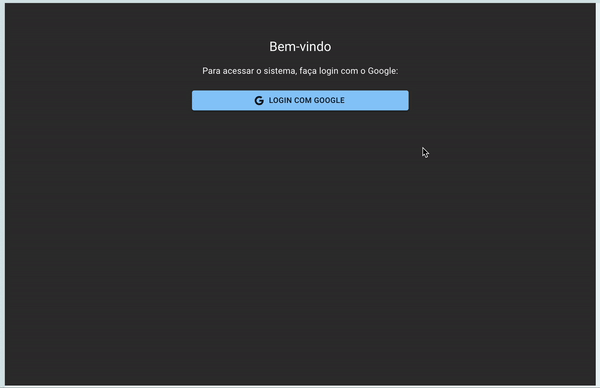

Aqui está uma estrutura para o README que inclui seções principais e o GIF animado que está no diretório public. Esse exemplo é focado em fornecer uma visão geral do projeto e instruções detalhadas de uso:

# Node.js Code Generator - NestJS Back-end



## Descrição
Bem-vindo ao **Node.js Code Generator**, uma aplicação que facilita a criação de back-ends completos em Node.js utilizando o framework **NestJS**. Esta ferramenta permite configurar uma nova aplicação definindo parâmetros de conexão com o banco de dados (PostgreSQL ou MySQL) e selecionando componentes personalizados para geração automática do código-fonte. 

## Funcionalidades
- 🛠 **Geração de código**: Cria automaticamente uma estrutura de back-end em NestJS com entidades, serviços, controladores e outros componentes essenciais.
- 🗄 **Suporte a múltiplos bancos de dados**: Configure sua aplicação para usar PostgreSQL ou MySQL.
- 📂 **Configuração personalizada**: Defina o diretório de saída e os componentes que deseja incluir.
- 🖱 **Interface intuitiva**: Configure facilmente uma nova aplicação e visualize ou edite aplicações existentes.

## Pré-requisitos
Para rodar o projeto, você precisará:
- **Node.js** (>=14.0.0)
- **Docker** (para execução em ambiente containerizado)
- **Yarn** ou **npm** para gerenciamento de pacotes

## Configuração do Projeto

1. **Clone o repositório**:
    ```bash
    git clone https://github.com/seu_usuario/node-code-generator.git
    cd node-code-generator
    ```

2. **Instale as dependências**:
    ```bash
    npm install
    ```
    ou
    ```bash
    yarn install
    ```

3. **Configuração do Docker**:
   O projeto possui um ambiente Docker configurado para facilitar a execução. Para iniciar os containers, execute:
   ```bash
   docker-compose up

	4.	Variáveis de Ambiente:
Para personalizar a conexão com o banco de dados e outras configurações, ajuste as variáveis no arquivo .env. Exemplo:

DB_HOST=localhost
DB_PORT=5432
DB_USER=postgres
DB_PASSWORD=postgres


Uso

	1.	Acessando a Interface:
Abra o navegador e acesse a interface em http://localhost:3000.
	2.	Criando uma Nova Aplicação:
No painel, vá até “Inserir Nova Aplicação”. Preencha as informações, como host, porta, banco de dados, usuário e senha, selecione os componentes desejados e clique em “Gerar Código”.
	3.	Visualizando e Editando Aplicações:
Após criar uma aplicação, você pode visualizá-la e editá-la na seção “Ver Aplicações Geradas”.

Estrutura do Projeto

	•	src/: Código-fonte principal.
	•	components/: Componentes reutilizáveis do front-end.
	•	services/: Serviços de back-end gerados.
	•	controllers/: Controladores de rotas de API.
	•	modules/: Módulos do NestJS para organização de funcionalidades.
	•	public/: Contém ativos públicos como o GIF de demonstração.

Contribuindo

Para contribuir com o projeto, faça um fork, crie uma nova branch para suas mudanças e envie um pull request. Agradecemos qualquer tipo de contribuição!

Licença

Este projeto é licenciado sob a MIT License. Consulte o arquivo LICENSE para mais detalhes.

Exemplo de Uso

Este GIF demonstra como é fácil configurar e gerar um back-end completo com apenas alguns cliques.

### Pontos-chave:
- **GIF animado**: Incluído no início e também na seção de exemplo de uso para ilustrar o fluxo.
- **Estrutura clara**: Inclui instalação, configuração, uso e estrutura do projeto.
- **Explicação do Docker e variáveis de ambiente**: Facilita a configuração em ambientes de desenvolvimento.